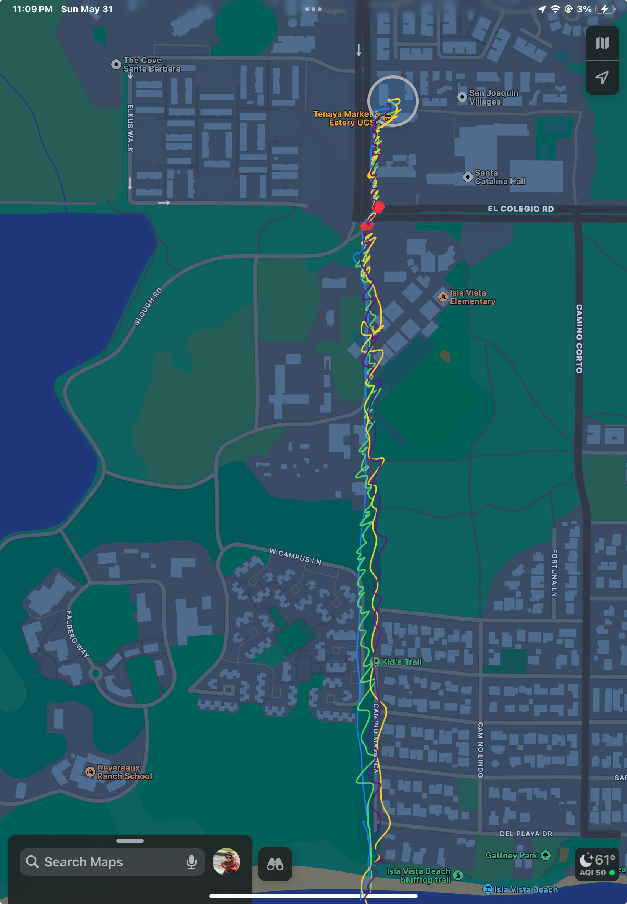

```{r}
#| label: set-up
#| message: false
#read packages
library(tidyverse)
library(janitor)
library(here)


#store kelp data
kelp <- read.csv("data/temp-kelp.csv")

#store personal data
walks <- read.csv("data/walks_data.csv")
```

# 1)
## a)
The appropriate tests we can run to test the strength of the relationship 
between temperature and giant kelp frond elongation rate are a Pearson's 
correlation test and a Spearman's rank correlation. 
The differences between the two tests are that a Pearson's test observes the 
strength between linear relationships while the Spearman's test observes the 
strength between monotonic relationships that do not need to be linear. 

## b) Visualizations

```{r}
#| echo: false

ggplot(kelp, mapping = aes( x = temp_c, y = kelp_elong)) +
# base ggplot, change color and size 
# of points
geom_point(color = "pink3", size = 3)+
#change x-axis to temp(celsius) 
#change y to kelp length (cm)  
  labs( x = "Temperature (Celsius)", 
        y = "Kelp Length (cm)") +
  #change theme from base
  theme_linedraw()


```


## c) Checking Assumptions / Run test

```{r}
#| label: assumptions
#| fig-height: 8
#| fig-width: 6

#create linear model for kelp data
kelp_model <- lm (kelp_elong ~ temp_c, data = kelp)

#show lm for kelp
kelp_model
#kelp elongation as function of temp
#
#plotted as 2x2 grid
 par(mfrow = c(2,2))
 #summary plots of kelp model
plot (kelp_model) 
 


```

Checked normality, homoscedasticity, and any outliers of data with summary plots. Found to be normal, linear, with no outliers affecting data. 

```{r}
#| label: test
#pearsons cor test is the method for linear models
#run test with x as kelp elongation, y as temp, method as pearson
cor.test(x = kelp$temp_c, y = kelp$kelp_elong, method = "pearson")
```


## d)
To evaluate the strength of the relationship between temperature and giant kelp frond elongation rate, I used a Pearson's correlation test. 
We found a strong negative relationship between kelp elongation and temperature (Pearson's r = -0.69, t(30) = -5.19, p < 0.001), where temperature significantly predicted kelp elongation length (R^2^ = 0.476). We reject the null hypothesis due to the p-value being less than $\alpha$ = 0.05.

## e)
The Pearson's correlation shows a statistically significant negative relationship between kelp elongation and temperature. This shows that an increase in ocean or seawater temperature causes kelp growth to stunt, leading to shorter kelp within these affected regions. Further implications of this phenomena may lead to giant kelp height remaining at these shortened heights unless resistant regions are studied and found to have any possible mediation for non-resistant groups. 

## f) 

```{r}
#run spearmans rank test
cor.test( x = kelp$temp_c, y = kelp$kelp_elong, method = "spearman")

```

The Spearman's test shows the same p-val as the Pearson's test leading me to the same conclusion (rejecting the null hypothesis). The change in test type keeps me from claiming a linear relationship due to the restrictions behind a Spearman's test. 

# 2a) Personal Data

```{r}
#from HW 2
walks |> 
mutate(work_due = as_factor(work_due))
       #factor so data is listed in order of appearance, cleans up repeats
#create graph, start with gg plot as base layer
# x = categorical predictor
ggplot(walks, aes(x = work_due, 
# y = response variable (in seconds to avoid graph looking skewed)
                  y = walk_time_s)) +
# scatter plot to compare relationship between predictor and response variable
geom_jitter(height = 0,
            width = 0,
            shape = 16,
            size=5,
#change color
           color="purple4") +
                        
#label graph
labs(title="Workload vs Walk time", 
     x = "Assignments due(#)",
     y = "Length of walk (sec)") +
#change theme
theme_linedraw()

```
### Fig 1
Scatterplot showing relationship between number of assignments due and length of walk in seconds. Each data point is represented by a purple point (n = 16). 

```{r}

#from HW2 to show potential relationship between degrees and walk time
#collect personal data
walks |> 

mutate(WEATHER_F = as_factor(WEATHER_F))

#create graph, start with gg plot as base layer
#x=continuous predictor, weather
#y= length of walk
#take degrees F ofdatqa sheet, abel in axis
ggplot(walks, aes(x = WEATHER_F, 
                  y = walk_time_s)) +
#scatter plot to compare relationship between continuous predictor and response 
geom_point(color="green3", size = 5) +

#label graph
labs(title = "Weather vs Walk Time", 
     x = "Weather(°F)", 
     y = "Length of Walk (sec)") +

#change theme
theme_bw()

```

### Fig 2
Scatterplot showing relationship between weather (in degrees Fahrenheit) and length of walk (in seconds) with each green point representing an individual walk (n=16). 

# 3
### a)
An affective visualization for this project could look like the route of the walk I would take during the personal data project. I could differentiate the route tracking by altering line color/width depending on assignment due. I could also include red stop signs or another visualization to illustrate where the walks would typically get slowed down. 

### b)


### c)



### d)
This piece shows the route of the walk I would take along with a display of the various different workloads I had while taking the walk. I was influenced by Jill Pelto's artwork displaying scenic backgrounds which provided information to the data she was displaying. I took inspiration by displaying (albeit not art) the route to help show the visualization of work due and walk time. The process for my draft was simply taking a screenshot of the route (for simplicty) and adding the various lines (with different colors and shape) to help differentiate between the various workloads.

# 4
### a)

The test the authors selected was a t-test, more specficially for this article the test is an unpaired Welch's two-sample t test.
The response variable for this experiment is the AQI (air quality index) of 4 sites encompassing major cities in India (ITO-Delhi, Worli-Mumbai, Jadavpur-Kolkata, and Manali Villiage-Chennai) while the predictor variable is COVID-19 lockdown confinement (Reduced human activity).
